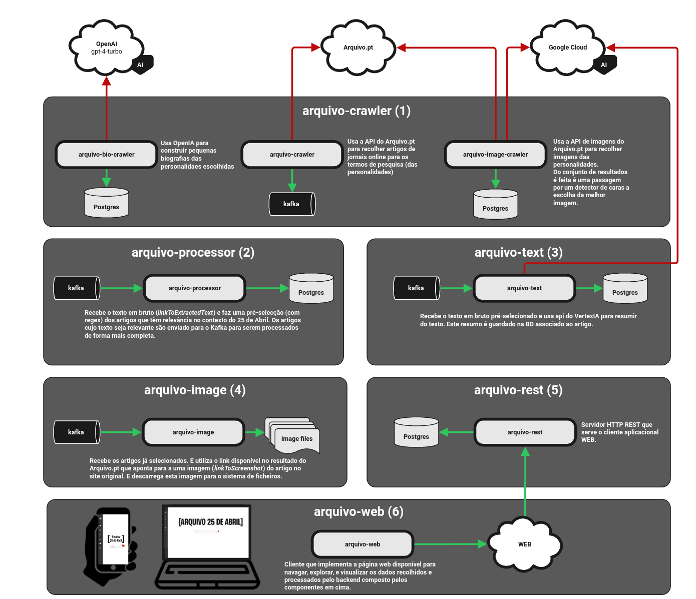

# Arquivo 25 de Abril 

## 📌 Table of Contents
- [Motivação](#motivação)
- [Considerações pessoais](#considerações-pessoais)
- [Agradecimentos](#agradecimentos)
- [Arquitectura](#arquitectura)
- [Referências](#referências)
    - [Livros](#livros)
    - [Podcasts](#podcasts)
    - [Documentários](#documentários)

## Motivação

**O 25 de Abril de 1974 encerrou um período de 48 anos em que Portugal viveu em ditadura (7 anos de Ditadura Militar seguidos de 41 anos de Estado Novo), dando lugar ao regime democrático que prevalece até aos nossos dias.**  
É, por isso, o evento mais importante do século XX na História portuguesa.

**O principal objetivo deste projeto é promover a memória do maior acontecimento do século XX em Portugal através dos artigos da imprensa online.**  
Portanto, este projeto coloca em destaque a importância da imprensa online como um arquivo histórico através de um olhar jornalístico.  
A imprensa online é, por excelência, um meio de comunicação acessível e isento.  
Não menos importante, este projeto também tem o propósito de homenagear os que lutaram por um Portugal livre e sem os quais iniciativas como o Prémio Arquivo.pt e este projeto não existiriam.

**O Arquivo.pt preserva toda a Web Portuguesa desde 1991.**  
Neste projeto, o Arquivo.pt funcionou como um motor de busca de artigos de jornais, visto que é possível fazer pesquisas por um termo, num determinado site e num intervalo temporal.  
Sem este trabalho do Arquivo.pt, seria impossível recolher alguns dos artigos que já não estão acessíveis através dos sites atuais.  
O Arquivo.pt foi, por isso, a principal fonte de dados e sem ele seria muito complicado aceder a todos os diferentes sites e conseguir "viajar no tempo".

**O principal resultado foi a criação de um arquivo temático com uma visão jornalística da história do 25 de Abril.**  
O número considerável de artigos que foram escritos ao longo destes anos na imprensa portuguesa sobre o 25 de Abril (de uma forma geral) contribuiu para que este resultado seja (1) mais completo, pois tem uma cobertura maior e (2) mais rico, pois é possível cruzar diferentes fontes para a mesma história.  
Quando iniciei o projeto, não esperava encontrar tantos artigos publicados sobre este tema e os seus atores.

O resultado final deste projeto é fruto de várias decisões pessoais, em particular na seleção das fontes noticiosas.  
Foram escolhidos como fontes noticiosas os sites do:  
**Público, Diário de Notícias, Jornal de Notícias, Expresso, Observador, SIC Notícias e TSF**.

## Considerações pessoais

Em relação às entidades de pesquisa, foram selecionadas com base no conhecimento do autor do tema através de livros, podcasts, documentários e de conversas com pessoas que viveram o 25 de Abril na primeira pessoa.  
Portanto, o autor pede desde já desculpa por não ter sido tão completo como o tema exige.

Em particular, queria referir que falhei na menção ou referência de vários dos resistentes que sobreviveram ou não à opressão.  
No entanto, queria sugerir a visita ao site do Museu do Aljube onde podem encontrar [testemunhos dos que sobreviveram](https://www.museudoaljube.pt/centro-de-documentacao/testemunhos/) e referências aos que [lutaram mas não sobreviveram para contar a história](https://www.museudoaljube.pt/centro-de-documentacao/biografias/).

## Agradecimentos

Quero agradecer ao historiador **Jorge Martins** e ao meu mestre **José Oliveira**, duas pessoas que viveram o 25 de Abril durante a juventude e dispensaram o seu tempo para sugerir nomes e melhorias.

## Arquitectura 

## Referências

### Livros
- *25 de Abril: Documento* (2ª Edição, revista e aumentada). Afonso Praça, Albertino Antunes, António Amori, Cesário Borga, Fernando Cascais
- *Censura - O Lápis Azul do Silêncio*. Ana Aranha
- *Portugal no Século XX - Os Anos 70*. César Santos Silva
- *Os Últimos do Estado Novo*. José Pedro Castanheira
- *1973: Uma Cronologia do Ano Zero. Os Factos, as Figuras e os Figurantes do Último Ano do Estado Novo*. Tiago Beato
- *Ensaios de Abril*. Fernando Rosas

### Podcasts
- Histórias da Classe Trabalhadora
- De Cravo ao Peito
- Antes da Revolução
- Inquietação, inquietação!
- Avenida da Liberdade
- Retratos de Abril
- Clandestinos

### Documentários
- *A Pide Leninha* (RTP Play)
- *Prisioneiros de Guerra* (RTP Play)
- *Conceição Matos: Coragem hoje, abraços amanhã* (RTP Play)
- *Salgueiro Maia - Rumo à Eternidade* (RTP Play)
- *Os Últimos Dias da PIDE* (RTP Play)
